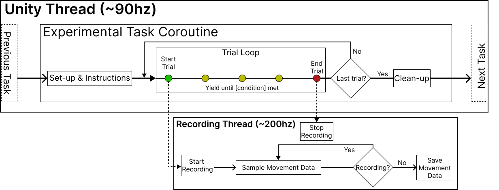
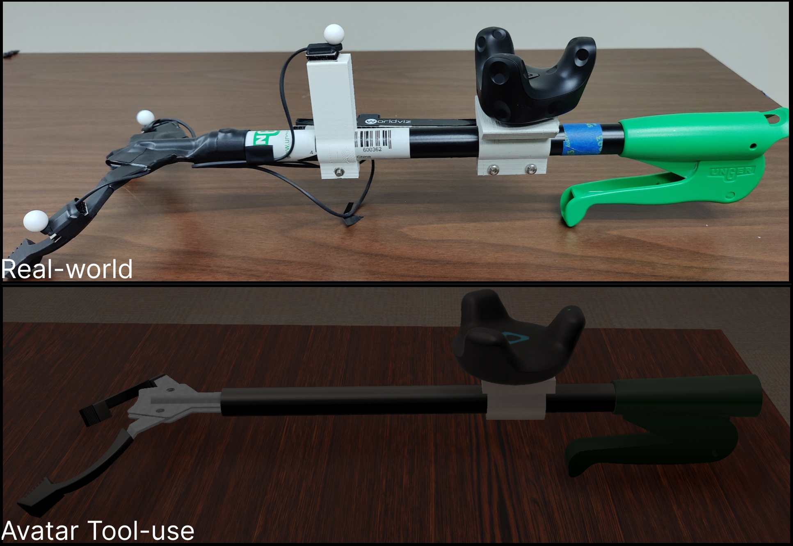

# Virtual Tool-use: Exploring Tool Embodiment in Virtual Reality

This is a repository for my dissertation work, including two studies on tool-use/tool embodiment (three samples of participants, total *n* = 72). The studies were pre-registered on the Open Science Framework (OSF).

The results of the studies are hosted on GitHub [here](https://www.github.com/jashobell/vr-tool-use-results).

The repository reflects the latest revision of the VR environment and experimental scripts, developed in Unity 2021.3.14f, using the Universal Render Pipeline. 

Differences between the tasks and environment of the three studies are described in the dissertation, which will be made available in some form after I defend it.

Custom code used in this study is licensed under the MIT license. Derivative code from other sources is licensed under the terms of the original license.

### Dependencies
- FinalIK 2.2 [link](https://assetstore.unity.com/packages/tools/animation/final-ik-14290) - Used to implement IK for the avatar.
- Manus Core 2.0.1 [link](https://assetstore.unity.com/packages/tools/integration/manus-core-2-0-1-181201) - Used to implement hand tracking with the Manus Quantum VR gloves.
- Rocketbox-Unity [link](https://www.github.com/jashobell/rocketbox-unity) - A fork of the Rocketbox avatar library with some additional features relating to using the avatars as self-avatars.

# Study Flow
The study mainly used Coroutines to control the flow of the experiment. To record data, additional threads were opened which sampled the data directly from VRPN, Manus Core, and OpenVR at the highest rate possible.

<picture>
    <source srcset="./figures/programmatic_design.png" media="(min-width: 800px)">
    
</picture>

The main flow of the experiment was as follows:

**Menu Scene**
    
- (Avatar VR) Select Avatar

**Participant Calibration Scene (participantCalibration scene)**    

- Mostly handled via `Calibration/ParticipantCalibration.cs`
    - Validate Universe Alignment 
        - `Calibration/ExperimentCalibration.cs` 
        - `Calibration/UniverseCalibrationValidation.cs`
    - (Avatar VR) Calibrate Avatar IK targets and Avatar scale
        - `Calibration/AvatarCalibration.cs`
        - `Avatars/AvatarHandler.cs`
        - `Calibration/AutoPivotPointFinder.cs`
    - Calibrate Eye Tracking
    - Walking Task
    - Final Calibration (Manual adjustments if needed)

**Experiment Scene (AvatarLab, Lab, noVRLab)**
    
- Pre-experiment
    - Fill UXF UI -> Start `Session`
        - `Assets/taskAssets/Generation/ExperimentGenerator.cs` generated the blocks/trials
        - `StimuliSetup.cs` removed/added objects to the scene as needed
        - `InstructionsDisplay.cs` displayed instructions (via scene object `instructionsCanvas`) and controlled the visible text for the researcher view (Non-avatar VR and Real-world)
        - All of these are attached to the `experimentObjects` object in the scene
- Experimental Tasks
    - Landmark Localization Task and Reaching Task (random order, more detail below)
    - Tool-use Task (more detail below)
    - Landmark Localization Task and Reaching Task (random order)
- End `Session`

Post-experiment Questionnaire (in real world)

# Contents

## Virtual Environment(s)
The main scenes for the final, Avatar VR, study were the `Assets/Scenes/participantCalibration` and `Assets/Scenes/AvatarLab` scenes. The older scenes, `Assets/Scenes/Lab` and `Assets/Scenes/noVRLab` were used for the original study and the real-world follow up, respectively. These scenes may be missing prefabs, scripts, or other assets that have been deleted/renamed/revised since they were conducted.

<picture>
    <source srcset="./figures/real_virtual_rooms.png" media="(min-width: 800px)">
    
</picture>

<picture>
    <source srcset="./figures/real_virtual_tool.png" media="(min-width: 800px)">
    
</picture>

I used CC0 Textures from [PolyHaven](https://www.polyhaven.com) and [AmbientCG](https://ambientcg.com) for the textures in the virtual environment. The virtual environment was modeled in Blender, and imported into Unity. The environment was built in the Unity Editor, using the Universal Render Pipeline.

## Calibration Procedures

### Universe Calibration

The SteamVR universe was held in place via a Vive Tracker 3.0. The tracker directly modified the tracking universe's position and yaw, while applying the roll and pitch to a parent transform that contained all SteamVR objects. This was facilitated by the `Calibration/ExperimentCalibration.cs` script, which was attached to `OpenVROriginTracker` in the scene.

### Avatar Calibration

The Avatar was calibrated to the participant via a procedure wherein: 
- A point cloud is generated at the approximate location of the desired IK target
- The point cloud is parented to a tracker, attached to the limb segment downstream of the desired IK target.
- The limb segment is moved along the three axes of rotation
- After a threshold amount of rotation on the axes is collected, the point cloud centered itself on the point that moved the least, and reduced the inter-point distance
- After a few iterations, the final IK target is set to the point with the least movement during rotation

This was repeated for the right wrist, elbow, shoulder and neck. The wrist and neck were used for IK targeting, while the elbow and shoulder were used to set the scale of the avatar's arm. The scale was set by the distance between the wrist and elbow trackers, and the distance between the elbow and shoulder trackers, respectively. Videos of this procedure can be found in the [results repository](https://www.github.com/jashobell/vr-tool-use-results).

## Tasks and Measures

The outcome measures for this study were movement characteristics and localization errors, collected from a reaching task and a landmark localization task, respectively. Instructional videos showcasing and explaining the tasks can be found in `Assets/taskAssets/Instructions/Videos`. For Avatar VR, the instructions were narrated via a text-to-speech engine (Google Wavenet). The code used to generate the instructions is in `Assets/taskAssets/Instructions/Audio`.

### Reaching Task

**Description**: Participants engaged in a reaching task wherein they grasped, lifted and replaced a target object (`Stimulus_Rectangle`) repeatedly, 18 times per block. 

The task was facilitated by the `Assets/taskAssets/Reaching/ReachingTask.cs` script, which was attached to the `openVRObjects/AvatarLabObjects/Stimulus_Rectangle` object in the scene. The coroutine `ReachingTaskHandler()` controlled the flow of the task and toggling of the recording scripts. Generally, the task proceeded and yielded based on the collisions of fingertip colliders with the target object and starting locations.

Data was recorded via the scripts starting with `UXF` in `Assets/MovementTracking`, which were attached to the children of `experimentObjects/kinematicRecorderHub` in the scene. The papers present data from the `UXFVRPNTracker.cs` script, specifically.

The tool-use task was handled the same way as the manual reaching task, but the colliders which controlled the task flow are instead set to the prongs of the grabber tool, and there were 48 trials.

### Landmark Localization Task

**Description**: Participants engaged in a landmark localization task wherein they aimed to stop an oscillating sphere at a target location along the arm, specified at the beginning of a trial. Participants responded using a Vive controller. The body was invisible during this task.

The task was facilitated by the `Assets/taskAssets/Landmark/LandmarkEstimateTracker.cs` script, which was attached to the `openVRObjects/landmarkTaskObjects/landmarkStimulus` object in the scene. Data was recorded via this script. The sphere's oscillations were controlled by the `Assets/taskAssets/Landmark/OscillateStimulus.cs` script.